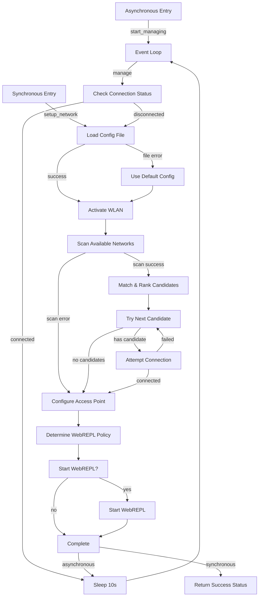

# micropython-wifimanager
A simple network configuration utility for MicroPython on boards such as ESP8266 and ESP32.

#### Test Start

Upload wifi_manager.py and your networks.json, then in the REPL:

```python
# simple_test.py — copy to board and run in REPL
from wifi_manager import WifiManager

# this should synchronously connect to your first known network
# and return True/False immediately
ok = WifiManager.setup_network()
print("✅ network OK" if ok else "❌ network failed")
```

#### Production Usage

##### a) Asynchronous, managed in background
Create main.py on your device:

```python
import uasyncio as asyncio
import logging
from wifi_manager import WifiManager

logging.basicConfig(level=logging.INFO)
WifiManager.on_connection_change(lambda evt, **kw: print("Event:", evt, kw))

# start the periodic manager
WifiManager.start_managing()

# hand off to uasyncio
asyncio.get_event_loop().run_forever()
```

> **Note:** scans and auto-reconnects every 10 s per your config.

##### b) Auto-start on boot

###### 1.	`boot.py` (runs at power-on, no REPL)

```python
# boot.py
import machine, os
# mount filesystem, etc.
# then launch main.py automatically
try:
    import main
except Exception as e:
    # fail-safe: at least bring up AP
    from wifi_manager import WifiManager
    WifiManager.setup_network()
```
###### 2.	`main.py` (as above)

With that in place, on every reset your board will:
	•	Run boot.py
	•	Hand off to your async manager in main.py,
	•	Bring up either your known STA networks or fallback AP + WebREPL.

#### Configuration

Simply upload your JSON file with your networks, the default path is '/networks.json', which is specified in the class property `config_file`.

A sample configuration may look like this:

	{
		"schema": 2,
		"known_networks": [
			{
				"ssid": "User\u2019s iPhone",
				"password": "Password1",
				"enables_webrepl": false
			},
			{
				"ssid": "HomeNetwork",
				"password": "Password2",
				"enables_webrepl": true
			}
		],
		"access_point": {
			"config": {
				"essid": "Micropython-Dev",
				"channel": 11,
				"hidden": false,
				"password": "P@55W0rd"
			},
			"enables_webrepl": true,
			"start_policy": "fallback"
		},
		"config_server": {
			"enabled": false,
			"password": "micropython"
		}
	}

#### Configuration schema

* **schema**: currently this should be `2`
* **known_networks**: list of networks to connect to, in order of most preferred first
	* SSID - the name of the access point
	* password - the clear-text password to use
	* enables_webrepl - a boolean value to indicate if connection to this network desires webrepl being started
* **access_point**: the details for the access point (AP) of this device
	* config - the keys for the AP config, exactly as per the micropython documentation
	* enables_webrepl - a boolean value to indicate if ceating this network desires webrepl being started
	* start_policy - A policy from the below list to indicate when to enable the AP
		* 'always' - regardless of the connection to any base station, AP will be started
		* 'fallback' - the AP will only be started if no network could be connected to
		* 'never' - The AP will not be started under any condition
* **config_server**: optional web configuration interface settings
	* enabled - boolean to enable/disable the web config interface
	* password - password for HTTP Basic Authentication (username is "admin")

#### Simple usage (one shot)

Here's an example of how to use the WifiManager.

	MicroPython v1.9.4 on 2018-05-11; ESP32 module with ESP32
	Type "help()" for more information.
	>>> from wifi_manager import WifiManager
	>>> WifiManager.setup_network()
	connecting to network Foo-Network...
	WebREPL daemon started on ws://10.1.1.234:8266
	Started webrepl in normal mode
	True


#### Asynchronous usage (event loop)

The WifiManager can be run asynchronously, via the cooperative scheduling that micropthon has in uasyncio. If you call `WifiManager.start_managing()` as follows, it will ensure that periodically the network status is scanned, and connection will be re-established as per preferences as needed.

	import uasyncio as asyncio
	import logging
	from wifi_manager import WifiManager

	logging.basicConfig(level=logging.WARNING)
	WifiManager.start_managing()
	asyncio.get_event_loop().run_forever()

#### Web configuration interface

For easier configuration management, WifiManager includes an optional web interface that allows you to view and edit the configuration remotely through a browser.

**Enable in configuration:**
```json
{
	"schema": 2,
	"known_networks": [...],
	"access_point": {...},
	"config_server": {
		"enabled": true,
		"password": "your-password-here"
	}
}
```

**Manual start:**
```python
from wifi_manager import WifiManager
WifiManager.start_config_server("your-password")
```

**Usage:**
1. Connect to your device's network (either managed network or AP)
2. Open browser to `http://[device-ip]:8080`
3. Enter username "admin" and your configured password
4. Edit JSON configuration in the web interface
5. Click "Save & Apply" to update and restart networking

**Features:**
- Live JSON validation
- Automatic network restart after changes
- HTTP Basic Authentication protection
- Works with any modern browser
- Integrated with async event loop

#### Connection state callbacks

WifiManager can notify your application when the WiFi connection state changes, allowing you to respond to connectivity events in real-time.

**Register a callback:**
```python
def my_connection_handler(event, **kwargs):
    if event == 'connected':
        print(f"Connected to {kwargs.get('ssid')} with IP {kwargs.get('ip')}")
        # Turn on LED, start data collection, etc.
    elif event == 'disconnected':
        print("Lost WiFi connection")
        # Turn off LED, pause operations, etc.
    elif event == 'ap_started':
        print(f"Started access point: {kwargs.get('essid')}")
        # Different LED color for AP mode
    elif event == 'connection_failed':
        print(f"Failed to connect to: {kwargs.get('attempted_networks')}")
        # Log failure, try alternative approach

from wifi_manager import WifiManager
WifiManager.on_connection_change(my_connection_handler)
WifiManager.start_managing()
```

**Available events:**
- `connected` - Successfully connected to a network (includes `ssid` and `ip`)
- `disconnected` - Lost connection to network
- `ap_started` - Access point was activated (includes `essid`)
- `connection_failed` - All connection attempts failed (includes `attempted_networks`)

**Features:**
- Multiple callbacks supported
- Automatic state change detection
- Exception handling in callbacks won't crash the manager
- Callbacks can be added/removed dynamically


#### Contribution

Found a bug, or want a feature? open an issue.

If you want to contribute, create a pull request.

#### System flow


